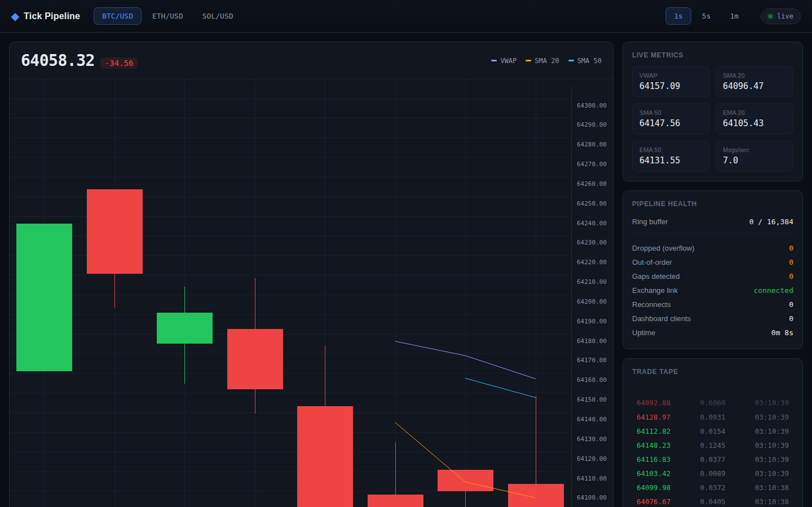

# Crypto Tick Pipeline

A live WebSocket ingestion pipeline for crypto trade data: connects to
Coinbase Exchange's public trade stream, computes rolling VWAP, moving
averages, and multi-timeframe OHLC candles in real time, and serves it all
— REST + a live WebSocket feed — to a dashboard. Built around handling
backpressure, out-of-order ticks, and dropped messages, with a benchmark
showing an 8.2x throughput gain from batching over a naive per-message
pipeline.

Full write-up (architecture, the math, the scale numbers, the debugging
log): [Tick Pipeline Field Notes](https://claude.ai/code/artifact/27aeb183-7fff-4aaf-a931-2fe74514a325)

## Demo



## Running it

```
./scripts/run.sh
```

Creates a virtualenv, installs dependencies, and serves the dashboard at
`http://localhost:8000`.
